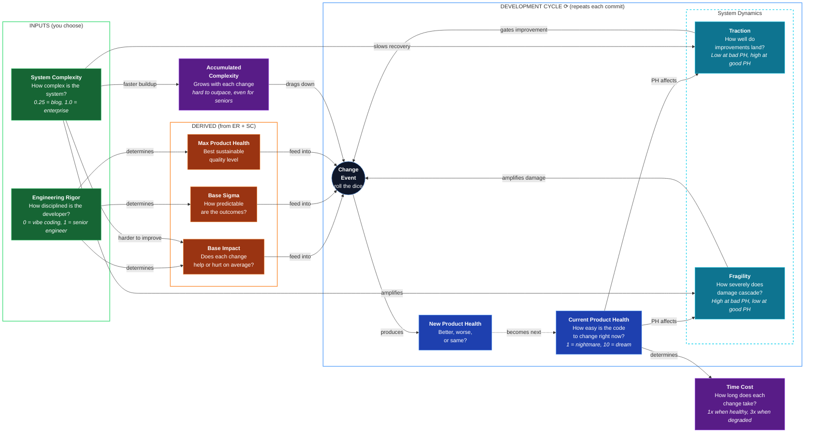

# Product Health Dynamics

A simulation that predicts how software quality evolves based on **engineering rigor** and **system complexity**. It reveals the hidden cost of "vibe coding" and quantifies the effort required to recover.

> _You've built an app. It works. And one day as you are polishing some styling, the AI accidentally deletes 40% of the tests in the backend part of the app. You do not notice, because you are vibe coding, and in the process of making coffee in another room._
>
> _You happily go about your day, blissfully unaware of all what is going on inside the code realms._
>
> _Fast forward two weeks. You now ask the AI to add a new feature. It does. Worked yet again, "vibe coding is great!"_
>
> _Then suddenly, BOOM!_
>
> _Apparently feature x and y broke, now when feature z was added. If we only had tests that would have prevented this..._
>
> _Now we're in a bad situation. Because when I vibe-asked the AI to fix feature x and y while also keeping feature z working, they all started working... but then feature a, b and c suddenly broke, and feature d breaks also, but not always._
>
> _This is the situation I predict every vibe coded project will eventually end up in, if one keeps doing it._

**The question this model answers:** Why does AI-assisted "vibe coding" work at first, then suddenly fall apart? What does recovery actually cost, in both quality AND time?

## Table of Contents

- [Quick Summary (No Math)](#quick-summary-no-math)
- [Core Concepts](#core-concepts)
- [The Model](#the-model)
- [Agent Profiles](#agent-profiles)
- [Complexity Profiles](#complexity-profiles)
- [What You'll See](#what-youll-see)
- [For Client Conversations](#for-client-conversations)
- [Usage](#usage)
- [Repository Structure](#repository-structure)
- [Mathematical Specification](#mathematical-specification)
- [Theoretical Grounding](./docs/theoretical-grounding.md)

---

## Quick Summary (No Math)

- **Product Health (PH)** measures how easy code is to change (1 = nightmare, 10 = trivial).
- Every code change can help, hurt, or do nothing. The outcome depends on **Engineering Rigor (ER)**: the skill and discipline of whoever makes the change.
- **System Complexity (SC)** determines how forgiving the system is. A blog is forgiving; an enterprise platform is not.
- **High PH protects you.** In a healthy codebase, even low-rigor changes are caught by tests, monitoring, and modular boundaries. Damage is contained.
- **Low PH punishes you.** In a coupled codebase, mistakes cascade. The same change causes 10-100x more damage.
- **Decay accelerates.** A healthy codebase drifts slowly, then suddenly falls apart once safety nets erode.
- **Recovery is slow, then accelerates, then plateaus.** Untangling a mess takes time before progress shows.
- **Degraded systems are slow.** Changes take 2-3x longer due to debugging, coordination, and regression testing. You pay in both quality AND velocity.

---

## Core Concepts

| Term                       | Definition                                    | Plain Meaning                                               |
| -------------------------- | --------------------------------------------- | ----------------------------------------------------------- |
| **Product Health (PH)**    | Software quality on a 1-10 scale              | How hard or easy changes feel right now                     |
| **Engineering Rigor (ER)** | Discipline applied to changes (0-1 scale)     | The difference between a calculated move and a gamble       |
| **System Complexity (SC)** | Inherent architectural complexity (0-1 scale) | How many moving parts? How tightly coupled by nature?       |
| **Traction**               | How well improvements land (from PH and SC)   | Healthy = changes land effectively. Degraded = changes slip |
| **Fragility**              | How severely damage cascades (from PH and SC) | Healthy = mistakes contained. Degraded = mistakes cascade   |
| **Change Event**           | A single modification to the codebase         | One commit, one roll of the dice                            |
| **Time Cost**              | How long a change takes relative to baseline  | Healthy = 1x, Degraded = up to 3x                           |

---

## The Model

### Visual Overview



### The Two Inputs

The model has two inputs. Everything else is derived.

**Engineering Rigor (ER)** determines three things:

| Property    | Formula                            | Meaning                       |
| ----------- | ---------------------------------- | ----------------------------- |
| Base Impact | `μ = 2.4 × (ER - 0.25 × (1 + SC))` | Expected PH change per commit |
| Base Sigma  | `σ = 0.1 + 0.7 × (1 - ER)`         | Outcome unpredictability      |
| Max Health  | `maxPH = 5 + 5 × ER`               | Sustainable ceiling           |

**System Complexity (SC)** scales the difficulty:

| SC                | Breakeven ER | Meaning                                |
| ----------------- | ------------ | -------------------------------------- |
| 0.25 (blog)       | 0.31         | Even juniors maintain it               |
| 0.50 (CRUD)       | 0.38         | Some discipline required               |
| 1.00 (enterprise) | 0.50         | Only skilled engineers sustain quality |

### Traction and Fragility

The model separates how Product Health affects **improvement** versus **degradation**. This creates emergent S-curve behavior without artificial thresholds.

**Normalized Health** maps PH (1-10) to a 0-1 scale:

```text
normalized = (PH - 1) / 9
```

**Traction** (for improvement) uses a power curve that makes progress slow at low PH and faster at high PH:

```text
traction = normalized^1.5
```

**Fragility** (for degradation) uses an inverse power curve that makes systems stable at high PH and increasingly fragile at low PH:

```text
fragility = (1 - normalized)²
```

System Complexity provides a floor. Simple systems never become as "frozen" as complex ones:

```text
effectiveTraction = (1 - SC) + SC × traction
effectiveFragility = fragility × SC
```

| PH  | Traction | Fragility | Simple (SC=0.25) Traction | Enterprise (SC=1.0) Traction |
| --- | -------- | --------- | ------------------------- | ---------------------------- |
| 8   | 0.68     | 0.05      | 0.92                      | 0.68                         |
| 5   | 0.32     | 0.31      | 0.83                      | 0.32                         |
| 2   | 0.04     | 0.79      | 0.78                      | 0.04                         |

**Plain meaning:** At PH=8, seniors have good traction (0.68) and degradation is contained (fragility 0.05). At PH=2, improvement is nearly impossible (traction 0.04) while damage cascades (fragility 0.79).

### The Compounding Effect

This is the core insight: **damage multiplies in unhealthy systems, and recovery is slow at first.**

When base impact is negative (degradation):

```text
effectiveDamage = baseDamage × fragility
```

- At PH=8: fragility ≈ 0.05, so only ~5% of potential damage applies. Tests catch regressions, modules contain blast radius.
- At PH=2: fragility ≈ 0.79, so ~80% of potential damage applies. Every mistake cascades.

The same low-rigor agent causes **~16x more degradation** in a coupled system than a healthy one.

When base impact is positive (improvement):

```text
effectiveImprovement = baseImprovement × traction × ceilingFactor
```

- At PH=2: traction ≈ 0.04, so only ~4% of improvement effort lands. The system is too tangled to respond.
- At PH=8: traction ≈ 0.68, so ~68% of improvement effort lands. Healthy systems accept changes gracefully.

**The S-curve emerges naturally:** At low PH, traction is near zero, so progress is glacial. As PH improves, traction grows, so progress accelerates. Near the ceiling, diminishing returns slow it again. No artificial sigmoid is needed; the behavior emerges from compounding dynamics.

### Time Cost: The Velocity Penalty

Degraded systems don't just produce worse outcomes; they're slower. The model tracks cumulative time **as a separate output** (not part of the ΔPH equation):

```text
systemState = (1 - SC) + SC × normalized
timeCost = 1.0 + 2.0 × (1 - systemState)
```

| PH (Enterprise) | Tractability | Time Cost | What It Represents  |
| --------------- | ------------ | --------- | ------------------- |
| 10              | 1.0          | 1.0x      | Baseline speed      |
| 5               | 0.44         | 2.1x      | Twice as slow       |
| 1               | 0.0          | 3.0x      | Three times as slow |

**The double penalty:** A vibe-coded project ends up with unusable code AND takes 2-3x longer to ship the same number of features. This is why "fast and cheap" development is neither.

### Each Change Event

Each change is a probabilistic event. The model draws from a Normal distribution:

```text
ΔPH = μ_eff + complexityDrift + σ_eff × N(0,1) × attenuation
```

| Term            | What It Represents                       |
| --------------- | ---------------------------------------- |
| μ_eff           | Expected impact (help or hurt)           |
| complexityDrift | Inherent disorder accumulating over time |
| σ_eff × N(0,1)  | Random component (the dice roll)         |
| attenuation     | How much randomness matters (see below)  |

**Key insight: Degradation and improvement have different variance profiles.**

For **degradation** (negative impact agents):

- Variance has a baseline (0.3) plus scales with fragility
- At high PH: visible bands during the early decline (fragility is low but baseline ensures some spread)
- At low PH: higher variance, but all runs converge to PH=1 anyway

For **improvement** (positive impact agents):

- Variance follows a bell curve, peaking in the transition zone (around PH=5)
- At low PH: lower variance (frozen system, limited outcomes)
- At mid PH: higher variance (chaotic transition zone)
- At high PH: lower variance (stable, predictable improvements)

This creates asymmetric confidence bands:

- Low-ER agents show visible bands during decline, then converge to PH=1
- High-ER agents have wider bands in the transition zone, tighter at extremes
- Ideal agents (ER=1) maintain tight bands everywhere (skill transcends complexity)

---

## Agent Profiles

| Agent              |  ER | Base Impact (SC=1.0) | Base Impact (SC=0.25) | Max Health |
| ------------------ | --: | :------------------: | :-------------------: | :--------: |
| AI Vibe Coder      | 0.3 |        -0.48         |         -0.03         |    6.5     |
| AI with Guardrails | 0.4 |        -0.24         |         +0.21         |    7.0     |
| Junior Engineer    | 0.5 |         0.00         |         +0.45         |    7.5     |
| Senior Engineer    | 0.8 |        +0.72         |         +1.17         |    9.0     |

**Key insight:** In enterprise systems, juniors break even while vibe coders degrade. In simple systems, vibe coders are nearly breakeven (-0.03) and juniors have solid positive impact. Simple systems forgive; complex systems punish.

---

## Complexity Profiles

| Profile    | SC   | Example                           | Character                                |
| ---------- | ---- | --------------------------------- | ---------------------------------------- |
| Simple     | 0.25 | Blog, landing page                | Very forgiving; most agents can maintain |
| Medium     | 0.50 | CRUD backend with auth            | Some discipline required                 |
| Enterprise | 1.00 | Complex domain, many integrations | Only high ER sustains quality            |

---

## What You'll See

The visualization shows trajectories starting at PH=8, representing the end of the "shape phase" where AI had full context.

**Enterprise (SC=1.0):**

- **AI Vibe:** Plateau at high PH, then accelerating decline, bottoming at PH=1
- **Junior:** Drifts slowly toward PH=3-4
- **Senior:** Climbs toward ~9, slight drift from accumulated complexity
- **Handoff (AI → Senior):** S-curve recovery from PH=1 to ~9

**Simple (SC=0.25):**

- **AI Vibe:** Nearly breakeven; slow drift, stays much healthier
- **Junior:** Positive impact; climbs toward ceiling
- **Handoff:** Rapid recovery from any low point


> Shaded bands are **confidence bands**: 80% of runs land within them. The solid line is the average.

---

## For Client Conversations

When a client suggests AI-assisted non-engineers can replace professional engineering:

1. **Present the model.** Engineering Rigor determines all outcomes. Low ER produces negative expected impact per change.

2. **Run the simulation.** Show the trajectory AND the time cost. They pay twice: worse quality AND slower delivery.

3. **Reference theory.** This aligns with [Lehman's Laws](./docs/theoretical-grounding.md): complexity grows unless actively reduced, quality declines unless rigorously maintained.

4. **Quantify the tradeoff.** For 1000 changes in an enterprise system:
   - Senior Engineers: Final PH ~8.7, Time overhead ~1%
   - AI Vibe Coding: Final PH ~1.0, Time overhead ~180%

---

## Usage

### Web Interface

```bash
npm install
npm run dev          # http://localhost:5173
```

See [Web Interface Documentation](./docs/ui.md) for details on configuration, agents, and persistence.

### CLI

```bash
npm run simulate:ai                              # AI Vibe Coder, enterprise
npm run simulate:ai -- --complexity simple       # AI Vibe Coder, simple system
npm run simulate:senior -- --complexity medium   # Senior, medium system
npm run simulate:handoff -- --changes 500        # Handoff scenario, 500 changes
```

Available flags:

- `--complexity simple|medium|enterprise` (default: enterprise)
- `--runs N` (default: 1000 simulations)
- `--changes N` (default: 1000 changes per simulation)

---

## Repository Structure

```text
src/
  model/
    Parameters.ts           # All tunable constants
    ProductHealthModel.ts   # Core simulation (ER, SC → impact, variance, time)

  runner/
    Trajectory.ts           # Monte Carlo runner (TrajectorySimulator class)
    Statistics.ts           # Aggregates runs into summary metrics

  scenarios/
    DeveloperProfiles.ts    # ER values for each developer type
    ComplexityProfiles.ts   # SC values (simple, medium, enterprise)
    ScenarioDefinitions.ts  # Scenario configurations

  ui/                       # Web interface (see docs/ui.md)
    templates/              # HTML template builders
    chart/                  # Chart.js visualization
    storage/                # LocalStorage persistence layer
    App.ts                  # UI orchestration class
    defaults.ts             # Default developers and simulations
    types.ts                # UI constants
    styles.css              # All styles

  utils/                    # Math helpers (sigmoid, gaussian, percentile)
  types.ts                  # Shared type definitions
  simulation.ts             # Public API
  cli.ts                    # Command-line interface
  main.ts                   # Web app entry point

docs/
  ui.md                     # Web interface documentation
  theoretical-grounding.md  # Academic references (Lehman's Laws)
```

---

## Mathematical Specification

For those who want the complete formulas.

### Parameters

| Parameter               |         Value | Rationale                                      |
| ----------------------- | ------------: | ---------------------------------------------- |
| Impact slope            |           2.4 | Produces ±1.2 max base impact at SC=1          |
| σ_min                   |           0.1 | Minimum variance at ER=1                       |
| σ_max                   |           0.8 | Maximum variance at ER=0 (visible bands)       |
| Ceiling base/slope      |           5/5 | Range from 5 (ER=0) to 10 (ER=1)               |
| Traction exponent       |           1.5 | Power curve: slow at low PH, faster at high PH |
| Fragility exponent      |           2.0 | Power curve: stable at high PH, fragile at low |
| Ceiling exponent        |             2 | Quadratic diminishing returns                  |
| Sigma scale floor/range |       0.6/0.4 | Bell curve scaling for variance                |
| Degradation baseline    |           0.3 | Baseline variance for visible bands            |
| Attenuation floor/range |     0.15/0.85 | Base variance reduction (bell curve)           |
| Improvement variance    |           2.5 | Extra variance for positive-impact agents      |
| Complexity base/growth  | 0.005/0.00005 | ~5% senior decline over 1000 changes           |
| Time base/max           |       1.0/3.0 | Healthy = 1x, frozen = 3x                      |

### Complete Formulas

**Normalized health (0-1 scale):**

```math
n = \frac{PH - 1}{9}
```

**Traction (for improvement, with complexity floor):**

```math
traction_{raw} = n^{1.5}
```

```math
traction = (1 - SC) + SC \times traction_{raw}
```

**Fragility (for degradation):**

```math
fragility = (1 - n)^2 \times SC
```

**Expected impact:**

```math
\mu_{base} = 2.4 \times (ER - 0.25 \times (1 + SC))
```

```math
\mu_{eff} = \begin{cases}
\mu_{base} \times fragility & \text{if } \mu_{base} \leq 0 \\
\mu_{base} \times traction \times \max(0, 1 - (PH/maxPH)^2) & \text{if } \mu_{base} > 0
\end{cases}
```

**Sigma (variance):**

```math
\sigma_{base} = 0.1 + 0.7 \times (1 - ER)
```

For improvement (positive impact):

```math
bellFactor = 4 \times systemState \times (1 - systemState)
```

```math
\sigma_{eff} = \sigma_{base} \times (0.6 + 0.4 \times bellFactor)
```

For degradation (negative impact):

```math
\sigma_{eff} = \sigma_{base} \times 0.6 \times (0.3 + 0.7 \times fragility)
```

**Accumulated complexity:**

```math
systemState = (1 - SC) + SC \times n
```

```math
drift = -(0.005 + 0.00005 \times changeCount) \times systemState \times SC
```

**Variance attenuation (asymmetric for improvement):**

```math
baseAttenuation = 0.15 + 0.85 \times bellFactor
```

```math
effectiveChallenge = (1 - ER) \times SC
```

```math
varianceBoost = systemState \times \max(0, \mu_{base}) \times effectiveChallenge \times 2.5
```

```math
attenuation = baseAttenuation + varianceBoost
```

The variance boost only applies when:

- `μ_base > 0` (agent is improving the system)
- `systemState` is high (agent at healthy PH, where systemState = (1-SC) + SC × n)
- `effectiveChallenge > 0` (agent is non-ideal in a complex system)

**Ceiling resistance (when PH > maxPH):**

```math
resistance = e^{-5 \times \frac{PH - maxPH}{maxPH}}
```

**Time cost (tracked separately, not part of ΔPH):**

```math
timeCost = 1.0 + 2.0 \times (1 - systemState)
```

```math
cumulativeTime = \sum_{i=0}^{n} timeCost_i
```

**Change event:**

```math
\Delta PH = \mu_{eff} + drift + \sigma_{eff} \times N(0,1) \times attenuation \times resistance
```

```math
PH_{n+1} = clamp(PH_n + \Delta PH, 1, 10)
```

### The Complete Equation

```math
PH_{n+1} = clamp\Big(PH_n + \mu_{eff} + drift + \sigma_{eff} \cdot \varepsilon \cdot a \cdot r, \; 1, \; 10\Big)
```

| Symbol    | Name               | Meaning                                                     |
| --------- | ------------------ | ----------------------------------------------------------- |
| PH_n      | Current Health     | Quality right now (1-10)                                    |
| μ_eff     | Effective Impact   | Help or hurt, modified by traction or fragility             |
| drift     | Complexity Drift   | Inherent disorder accumulating                              |
| σ_eff     | Effective Sigma    | Unpredictability of outcome                                 |
| ε         | Random Draw        | N(0,1), the dice roll                                       |
| a         | Attenuation        | Variance scaling (low at extremes, boosted for improvement) |
| r         | Ceiling Resistance | Variance reduction above ceiling                            |
| traction  | Traction           | How well improvements land (n^1.5)                          |
| fragility | Fragility          | How severely damage cascades ((1-n)²)                       |
| SC        | System Complexity  | Inherent difficulty (0.25 = blog, 1.0 = enterprise)         |

### The Story

1. **Skill (μ_eff)** determines whether changes help or hurt on average
2. **Complexity (SC)** sets the difficulty; simple systems forgive, complex systems punish
3. **Time (drift)** works against everyone, but slower for simple systems
4. **Traction** gates improvement; at low PH, even good engineers struggle to land changes
5. **Fragility** amplifies degradation; at low PH, every mistake cascades
6. **The S-curve emerges naturally** from compounding; no artificial thresholds needed
7. **Degradation shows variance** during early decline, then converges to PH=1
8. **Improvement has uncertainty**; even skilled agents face unexpected challenges in complex systems
9. **Time cost** means degraded systems are slow, not just bad
10. **In the long run**, only sustained high-skill effort can outpace complexity
