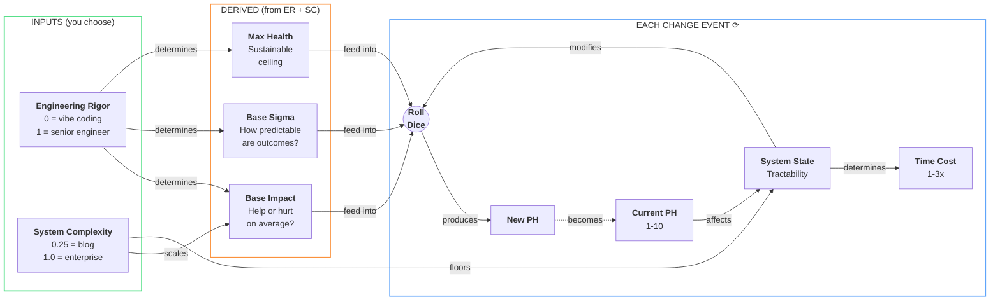

# Product Health Dynamics

A Monte Carlo simulation that predicts how software quality evolves based on **engineering rigor** and **system complexity**. It reveals the hidden cost of "vibe coding" and quantifies the effort required to recover.

> **The vibe coding story:**
>
> You build an app with AI. It works. One day while polishing styling, the AI accidentally deletes 40% of your backend tests. You don't notice because you're making coffee.
>
> Two weeks later, you add a feature. It works. Then features X and Y break. You ask the AI to fix them while keeping the new feature working. Now feature A, B, and C break. Feature D breaks intermittently.
>
> This is where every vibe-coded project ends up.

**The question this model answers:** Why does AI-assisted "vibe coding" work at first, then suddenly fall apart? What does recovery actually cost, in both quality AND time?

## Table of Contents

- [Quick Summary (No Math)](#quick-summary-no-math)
- [Core Concepts](#core-concepts)
- [The Model](#the-model)
- [Agent Profiles](#agent-profiles)
- [Complexity Profiles](#complexity-profiles)
- [What You'll See](#what-youll-see)
- [For Client Conversations](#for-client-conversations)
- [Usage](#usage)
- [Repository Structure](#repository-structure)
- [Mathematical Specification](#mathematical-specification)
- [Theoretical Grounding](./docs/theoretical-grounding.md)

---

## Quick Summary (No Math)

- **Product Health (PH)** measures how easy code is to change (1 = nightmare, 10 = trivial).
- Every code change can help, hurt, or do nothing. The outcome depends on **Engineering Rigor (ER)**: the skill and discipline of whoever makes the change.
- **System Complexity (SC)** determines how forgiving the system is. A blog is forgiving; an enterprise platform is not.
- **High PH protects you.** In a healthy codebase, even low-rigor changes are caught by tests, monitoring, and modular boundaries. Damage is contained.
- **Low PH punishes you.** In a coupled codebase, mistakes cascade. The same change causes 10-100x more damage.
- **Decay accelerates.** A healthy codebase drifts slowly, then suddenly falls apart once safety nets erode.
- **Recovery is slow, then accelerates, then plateaus.** Untangling a mess takes time before progress shows.
- **Degraded systems are slow.** Changes take 2-3x longer due to debugging, coordination, and regression testing. You pay in both quality AND velocity.

---

## Core Concepts

| Term                       | Definition                                    | Plain Meaning                                               |
| -------------------------- | --------------------------------------------- | ----------------------------------------------------------- |
| **Product Health (PH)**    | Software quality on a 1-10 scale              | How hard or easy changes feel right now                     |
| **Engineering Rigor (ER)** | Discipline applied to changes (0-1 scale)     | The difference between a calculated move and a gamble       |
| **System Complexity (SC)** | Inherent architectural complexity (0-1 scale) | How many moving parts? How tightly coupled by nature?       |
| **System State**           | Tractability derived from current PH and SC   | Healthy = mistakes are caught. Unhealthy = mistakes cascade |
| **Change Event**           | A single modification to the codebase         | One commit, one roll of the dice                            |
| **Time Cost**              | How long a change takes relative to baseline  | Healthy = 1x, Degraded = up to 3x                           |

---

## The Model

### Visual Overview



### The Two Inputs

The model has two inputs. Everything else is derived.

**Engineering Rigor (ER)** determines three things:

| Property    | Formula                            | Meaning                       |
| ----------- | ---------------------------------- | ----------------------------- |
| Base Impact | `μ = 2.4 × (ER - 0.25 × (1 + SC))` | Expected PH change per commit |
| Base Sigma  | `σ = 0.1 + 0.4 × (1 - ER)`         | Outcome unpredictability      |
| Max Health  | `maxPH = 5 + 5 × ER`               | Sustainable ceiling           |

**System Complexity (SC)** scales the difficulty:

| SC                | Breakeven ER | Meaning                                |
| ----------------- | ------------ | -------------------------------------- |
| 0.25 (blog)       | 0.31         | Even juniors maintain it               |
| 0.50 (CRUD)       | 0.38         | Some discipline required               |
| 1.00 (enterprise) | 0.50         | Only skilled engineers sustain quality |

### System State: The Sigmoid

Current Product Health determines how tractable the system is. The model uses a sigmoid function centered at PH=5:

```text
rawSystemState = 1 / (1 + e^(-1.5 × (PH - 5)))
```

System Complexity provides a floor. Simple systems never become as "frozen" as complex ones:

```text
systemState = (1 - SC) + SC × rawSystemState
```

| PH  | Raw State | Simple (SC=0.25) | Enterprise (SC=1.0) |
| --- | --------- | ---------------- | ------------------- |
| 8   | 0.99      | 1.00             | 0.99                |
| 5   | 0.50      | 0.88             | 0.50                |
| 2   | 0.01      | 0.76             | 0.01                |

**Plain meaning:** At PH=8, the system is tractable regardless of complexity. At PH=2, a simple system stays 76% tractable; an enterprise system is 99% frozen.

### The Compounding Effect

This is the core insight: **damage multiplies in unhealthy systems.**

When base impact is negative:

```text
effectiveDamage = baseDamage × (1 - systemState)
```

- At PH=8: systemState ≈ 0.99, so only ~1% of potential damage applies. Tests catch regressions, modules contain blast radius.
- At PH=2: systemState ≈ 0.01, so ~99% of potential damage applies. Every mistake cascades.

The same low-rigor agent causes **~100x more degradation** in a coupled system than a healthy one.

When base impact is positive:

```text
effectiveImprovement = baseImprovement × systemState × ceilingFactor
```

Improvement requires traction (systemState) and has diminishing returns near the agent's ceiling (ceilingFactor).

### Time Cost: The Velocity Penalty

Degraded systems don't just produce worse outcomes; they're slower. The model tracks cumulative time:

```text
timeCost = 1.0 + 2.0 × (1 - systemState)
```

| System State     | Time Cost | What It Represents  |
| ---------------- | --------- | ------------------- |
| 1.0 (healthy)    | 1.0x      | Baseline speed      |
| 0.5 (transition) | 2.0x      | Twice as slow       |
| 0.0 (frozen)     | 3.0x      | Three times as slow |

**The double penalty:** A vibe-coded project ends up with unusable code AND takes 2-3x longer to ship the same number of features. This is why "fast and cheap" development is neither.

### Each Change Event

Each change is a probabilistic event. The model draws from a Normal distribution:

```text
ΔPH = μ_eff + complexityDrift + σ_eff × N(0,1) × attenuation
```

| Term            | What It Represents                                           |
| --------------- | ------------------------------------------------------------ |
| μ_eff           | Expected impact (help or hurt)                               |
| complexityDrift | Inherent disorder accumulating over time                     |
| σ_eff × N(0,1)  | Random component (the dice roll)                             |
| attenuation     | How much randomness matters (frozen systems are predictable) |

**Key insight:** Variance is reduced at BOTH extremes of Product Health:

- High PH: Tests and structure make outcomes predictable (mostly good)
- Low PH: Everything is coupled; outcomes are predictably bad

This creates the characteristic sigmoid shape: plateau at high PH, accelerating decline through the transition zone, bottoming out at PH=1.

---

## Agent Profiles

| Agent              |  ER | Base Impact (SC=1.0) | Base Impact (SC=0.25) | Max Health |
| ------------------ | --: | :------------------: | :-------------------: | :--------: |
| AI Vibe Coder      | 0.3 |        -0.48         |         -0.03         |    6.5     |
| AI with Guardrails | 0.4 |        -0.24         |         +0.21         |    7.0     |
| Junior Engineer    | 0.5 |         0.00         |         +0.45         |    7.5     |
| Senior Engineer    | 0.8 |        +0.72         |         +1.17         |    9.0     |

**Key insight:** In enterprise systems, juniors break even while vibe coders degrade. In simple systems, vibe coders are nearly breakeven (-0.03) and juniors have solid positive impact. Simple systems forgive; complex systems punish.

---

## Complexity Profiles

| Profile    | SC   | Example                           | Character                                |
| ---------- | ---- | --------------------------------- | ---------------------------------------- |
| Simple     | 0.25 | Blog, landing page                | Very forgiving; most agents can maintain |
| Medium     | 0.50 | CRUD backend with auth            | Some discipline required                 |
| Enterprise | 1.00 | Complex domain, many integrations | Only high ER sustains quality            |

---

## What You'll See

The visualization shows trajectories starting at PH=8, representing the end of the "shape phase" where AI had full context.

**Enterprise (SC=1.0):**

- **AI Vibe:** Plateau at high PH, then accelerating decline, bottoming at PH=1
- **Junior:** Drifts slowly toward PH=3-4
- **Senior:** Climbs toward ~9, slight drift from accumulated complexity
- **Handoff (AI → Senior):** S-curve recovery from PH=1 to ~9

**Simple (SC=0.25):**

- **AI Vibe:** Nearly breakeven; slow drift, stays much healthier
- **Junior:** Positive impact; climbs toward ceiling
- **Handoff:** Rapid recovery from any low point


> Shaded bands are **confidence bands**: 80% of runs land within them. The solid line is the average.

---

## For Client Conversations

When a client suggests AI-assisted non-engineers can replace professional engineering:

1. **Present the model.** Engineering Rigor determines all outcomes. Low ER produces negative expected impact per change.

2. **Run the simulation.** Show the trajectory AND the time cost. They pay twice: worse quality AND slower delivery.

3. **Reference theory.** This aligns with [Lehman's Laws](./docs/theoretical-grounding.md): complexity grows unless actively reduced, quality declines unless rigorously maintained.

4. **Quantify the tradeoff.** For 1000 changes in an enterprise system:
   - Senior Engineers: Final PH ~8.7, Time overhead ~1%
   - AI Vibe Coding: Final PH ~1.0, Time overhead ~180%

---

## Usage

```bash
npm install          # Install dependencies
npm run dev          # Start visualization at http://localhost:5173
```

CLI:

```bash
npm run simulate:ai                              # AI Vibe Coder, enterprise
npm run simulate:ai -- --complexity simple       # AI Vibe Coder, simple system
npm run simulate:senior -- --complexity medium   # Senior, medium system
npm run simulate:handoff -- --changes 500        # Handoff scenario, 500 changes
```

Available flags:

- `--complexity simple|medium|enterprise` (default: enterprise)
- `--runs N` (default: 1000 simulations)
- `--changes N` (default: 1000 changes per simulation)

---

## Repository Structure

```text
src/
  model/
    Parameters.ts           # All tunable constants
    ProductHealthModel.ts   # Core simulation (ER, SC → impact, variance, time)

  runner/
    Trajectory.ts           # Monte Carlo runner
    Statistics.ts           # Aggregates runs into summary metrics

  scenarios/
    AgentProfiles.ts        # ER values for each agent type
    ComplexityProfiles.ts   # SC values (simple, medium, enterprise)
    ScenarioDefinitions.ts  # Scenario configurations

  chart/                    # Chart.js visualization
  utils/                    # Math helpers (sigmoid, gaussian, percentile)
  types.ts                  # Shared type definitions
  simulation.ts             # Public API
  cli.ts                    # Command-line interface
```

---

## Mathematical Specification

For those who want the complete formulas.

### Parameters

| Parameter               |         Value | Rationale                             |
| ----------------------- | ------------: | ------------------------------------- |
| Impact slope            |           2.4 | Produces ±1.2 max base impact at SC=1 |
| σ_min                   |           0.1 | Minimum variance at ER=1              |
| σ_max                   |           0.5 | Maximum variance at ER=0              |
| Ceiling base/slope      |           5/5 | Range from 5 (ER=0) to 10 (ER=1)      |
| Sigmoid threshold       |             5 | Midpoint of PH scale                  |
| Sigmoid steepness       |           1.5 | Moderate transition curve             |
| Ceiling exponent        |             2 | Quadratic diminishing returns         |
| Attenuation floor/range |     0.15/0.85 | Variance reduction at extremes        |
| Complexity base/growth  | 0.005/0.00005 | ~5% senior decline over 1000 changes  |
| Time base/max           |       1.0/3.0 | Healthy = 1x, frozen = 3x             |

### Complete Formulas

**System state (with complexity floor):**

```math
s_{raw} = \frac{1}{1 + e^{-1.5 \times (PH - 5)}}
```

```math
s = (1 - SC) + SC \times s_{raw}
```

**Expected impact:**

```math
\mu_{base} = 2.4 \times (ER - 0.25 \times (1 + SC))
```

```math
\mu_{eff} = \begin{cases}
\mu_{base} \times (1 - s) & \text{if } \mu_{base} \leq 0 \\
\mu_{base} \times s \times \max(0, 1 - (PH/maxPH)^2) & \text{if } \mu_{base} > 0
\end{cases}
```

**Sigma (variance):**

```math
\sigma_{base} = 0.1 + 0.4 \times (1 - ER)
```

```math
bellFactor = 4 \times s \times (1 - s)
```

```math
\sigma_{eff} = \sigma_{base} \times (0.6 + 0.4 \times bellFactor)
```

**Accumulated complexity:**

```math
drift = -(0.005 + 0.00005 \times n) \times s \times SC
```

**Variance attenuation (symmetric at extremes):**

```math
attenuation = 0.15 + 0.85 \times bellFactor
```

**Ceiling resistance (when PH > maxPH):**

```math
resistance = e^{-5 \times \frac{PH - maxPH}{maxPH}}
```

**Time cost:**

```math
timeCost = 1.0 + 2.0 \times (1 - s)
```

**Change event:**

```math
\Delta PH = \mu_{eff} + drift + \sigma_{eff} \times N(0,1) \times attenuation \times resistance
```

```math
PH_{n+1} = clamp(PH_n + \Delta PH, 1, 10)
```

### The Complete Equation

```math
PH_{n+1} = clamp\Big(PH_n + \mu_{eff} + drift + \sigma_{eff} \cdot \varepsilon \cdot a \cdot r, \; 1, \; 10\Big)
```

| Symbol | Name               | Meaning                                             |
| ------ | ------------------ | --------------------------------------------------- |
| PH_n   | Current Health     | Quality right now (1-10)                            |
| μ_eff  | Effective Impact   | Help or hurt, modified by system state              |
| drift  | Complexity Drift   | Inherent disorder accumulating                      |
| σ_eff  | Effective Sigma    | Unpredictability of outcome                         |
| ε      | Random Draw        | N(0,1), the dice roll                               |
| a      | Attenuation        | Variance reduction at extremes                      |
| r      | Ceiling Resistance | Symmetric variance reduction above ceiling          |
| s      | System State       | Tractability (0 = frozen, 1 = healthy)              |
| SC     | System Complexity  | Inherent difficulty (0.25 = blog, 1.0 = enterprise) |

### The Story

1. **Skill (μ_eff)** determines whether changes help or hurt on average
2. **Complexity (SC)** sets the difficulty; simple systems forgive, complex systems punish
3. **Time (drift)** works against everyone, but slower for simple systems
4. **Tractability (s)** amplifies everything; good code catches mistakes, bad code cascades them
5. **Randomness (ε)** means any single change could go either way, but averages reveal the trend
6. **Time cost** means degraded systems are slow, not just bad
7. **In the long run**, only sustained high-skill effort can outpace complexity
