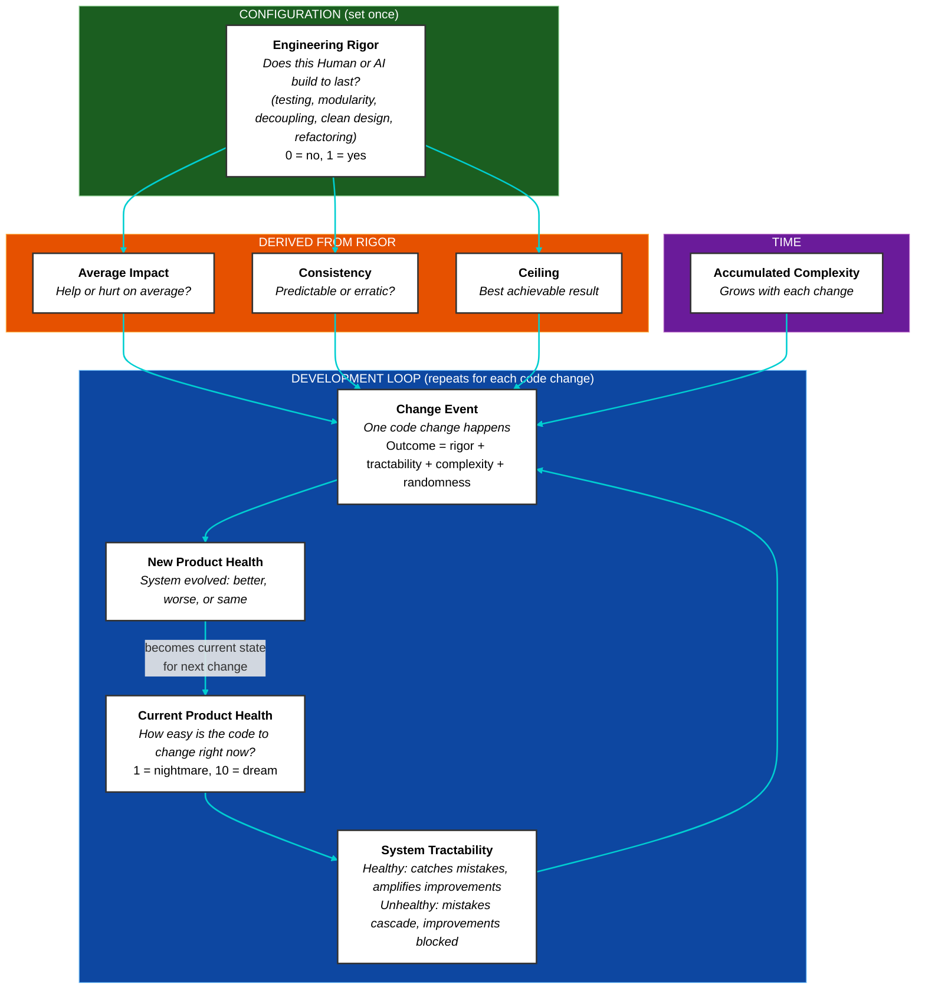

# Product Health Dynamics

A simulation model that predicts how software quality evolves over time based on the engineering rigor of whoever is making changes.

The model runs many randomized simulations (a technique called Monte Carlo simulation) to show not just the average outcome, but the range of likely outcomes. This reveals patterns that a single prediction would miss.

## Table of Contents

- [Quick Summary (No Math)](#quick-summary-no-math)
- [Core Concepts](#core-concepts)
- [The Model](#the-model)
  - [How It Works (Visual Overview)](#how-it-works-visual-overview)
  - [Engineering Rigor as the Master Dial](#engineering-rigor-as-the-master-dial)
  - [System State Modifies Everything](#system-state-modifies-everything)
  - [The Compounding Effect](#the-compounding-effect-the-entropy-metaphor)
  - [Each Change Event (The Roll of the Dice)](#each-change-event-the-roll-of-the-dice)
- [Agent Profiles](#agent-profiles)
- [What You'll See](#what-youll-see)
- [For Client Conversations](#for-client-conversations)
- [Theoretical Grounding (Research Basis)](./docs/theoretical-grounding.md)
- [Usage](#usage)
- [Repository Structure](#repository-structure)
- [Mathematical Specification](#mathematical-specification)
- [The Complete Equation](#the-complete-equation)

> **Vibe coding:**
>
> _You've built an app. It works. And one day as you are polishing some styling, the AI accidentally deletes 40% of the tests in the backend part of the app. You do not notice, because you are vibe coding, and in the process of making coffee in another room._
>
> _You happily go about your day, blissfully unaware of all what is going on inside the code realms._
>
> _Fast forward two weeks. You now ask the AI to add a new feature. It does. Worked yet again, "vibe coding is great!"_
>
> _Then suddenly, BOOM! 💥_
>
> _Apparently feature x and y broke, now when feature z was added. If we only had tests that would have prevented this…_
>
> _Now we're in a bad situation. Because when I vibe-asked the AI to fix feature x and y while also keeping feature z working, they all started working… but then feature a, b and c suddenly broke, and feature d breaks also, but not always._
>
> _This is the situation I predict every vibe coded project will eventually end up in, if one keeps doing it._

**The question this model answers:** Why does AI-assisted "vibe coding" seem to work at first, then suddenly fall apart? And what does it actually cost to recover?

## Quick Summary (No Math)

- **Product Health** measures how easy code is to change (1 = nightmare, 10 = trivial).
- Every code change can help, hurt, or do nothing. The outcome depends on **Engineering Rigor**: the skill and discipline of whoever makes the change.
- Low-rigor agents (AI vibe coders) have negative expected impact. The codebase decays.
- High-rigor agents (senior engineers) have positive expected impact. The codebase improves.
- **Decay is slow at first, then accelerates.** A healthy codebase catches mistakes (tests, clean structure, monitoring, error handling). A coupled codebase lets them cascade.
- **Recovery is slow at first, then accelerates, then plateaus.** Untangling a mess takes time before progress shows.

## Core Concepts

| Term                       | Definition                                                                                                            | Plain Meaning                                                                                              |
| -------------------------- | --------------------------------------------------------------------------------------------------------------------- | ---------------------------------------------------------------------------------------------------------- |
| **Product Health (PH)**    | Software quality at a point in time. Scale: 1-10.                                                                     | How hard or easy changes feel right now.                                                                   |
| **Change Event**           | A modification to the codebase.                                                                                       | The code that actually gets committed.                                                                     |
| **Engineering Rigor (ER)** | Degree to which changes apply: modularity, abstraction, separation of concerns, loose coupling, cohesion. Scale: 0-1. | Skill and discipline. The difference between a calculated move and a gamble.                               |
| **System Tractability**    | How forgiving or punishing the codebase is right now. Depends on current PH.                                          | Healthy: mistakes are caught or contained (tests, structure, error handling). Unhealthy: mistakes cascade. |
| **Shape Phase**            | Initial development where the AI has full context. Produces impressive results quickly.                               | The honeymoon period. Everything fits in the AI's immediate context window.                                |
| **Scale Phase**            | Ongoing development where context is lost. The model's dynamics dominate.                                             | Reality sets in. Simulations start here (e.g. PH=8) to show what happens next.                             |
| **Accumulated Complexity** | Inherent disorder that grows with each change. Even perfect engineering cannot fully prevent it.                      | Technical debt that accrues over time. The longer a project runs, the harder it becomes to maintain.       |

## The Model

### How It Works (Visual Overview)



### Engineering Rigor as the Master Dial

**Engineering Rigor (ER)** is the only input variable. Everything else is derived from it.

| Property        | Formula                    | What It Means                                                         |
| --------------- | -------------------------- | --------------------------------------------------------------------- |
| Base Impact (μ) | `μ = ER × 2.4 − 1.2`       | Expected PH change per commit. Positive above ER=0.5, negative below. |
| Base Sigma (σ)  | `σ = 0.1 + 0.4 × (1 − ER)` | Outcome unpredictability. High ER = consistent; low ER = erratic.     |
| Maximum Health  | `maxPH = 5 + 5 × ER`       | Sustainable ceiling. ER=0.8 → maxPH=9. ER=0.1 → maxPH=5.5.            |

### System State Modifies Everything

Current Product Health affects how changes land. This captures the reality that healthy codebases catch and contain mistakes (via tests, clean structure, error handling, monitoring, etc) while coupled codebases let them cascade.

The model computes an intermediate variable called **systemState**, which transforms Product Health into a 0-1 scale:

```math
\text{systemState} = \frac{1}{1 + e^{-1.5 \times (PH - 5)}}
```

**Plain meaning:** systemState answers "how tractable is this codebase right now?"

- At PH=8 (healthy): systemState ≈ 0.99. The system is tractable; it has tests, modularity, and clear boundaries.
- At PH=5 (threshold): systemState = 0.5. The tipping point between order and chaos.
- At PH=2 (degraded): systemState ≈ 0.01. The system is a tightly coupled mess; everything depends on everything.

| What's Modified      | Multiplied By                     | Effect                                                   |
| -------------------- | --------------------------------- | -------------------------------------------------------- |
| Negative base impact | `(1 − systemState)`               | Damage compounds at low PH, caught early at high PH      |
| Positive base impact | `systemState × (1 − (PH/maxPH)²)` | Hard to improve a mess; diminishing returns near ceiling |
| Base sigma           | `(0.6 + 0.4 × bellFactor)`        | Chaos peaks mid-range; predictable at extremes           |
| Random component     | `(0.15 + 0.85 × systemState)`     | Luck cannot save you at low PH; outcomes driven by mean  |

Where `bellFactor = 4 × systemState × (1 − systemState)` — a parabola that peaks at systemState=0.5 and falls to 0 at both extremes.

### The Compounding Effect (The "Entropy" Metaphor)

> **Note:** This is an analogy, not an application of thermodynamic laws. We use "entropy" as a metaphor because the observable pattern is similar: systems drift toward disorder without sustained effort. The underlying mathematics is different.

In physics, entropy describes how systems tend toward disorder without energy input. Software exhibits a similar pattern: without sustained engineering effort, codebases drift toward chaos.

The driver is **coupling**: how much one part of the code depends on other parts.

- **Loosely coupled:** Changing feature X doesn't break feature Y. Tests catch regressions. Modules have clear boundaries.
- **Tightly coupled:** Everything connects to everything. Fixing X breaks Y. Fixing Y breaks Z. This is the "BOOM" moment in the vibe coding story.

**The math:** When base impact is negative, effective damage = `base × (1 − systemState)`.

- At PH=8: systemState ≈ 0.99, so only ~1% of damage applies. Tests catch regressions, monitoring alerts on failures, modular design contains blast radius.
- At PH=2: systemState ≈ 0.01, so ~99% of damage applies. No safety nets; every mistake cascades through the tightly coupled system.

The same low-ER agent causes roughly **90× more degradation** in a coupled system than in a healthy one.

**Plain meaning:** Low-ER changes (no tests, no modularity) gradually tighten coupling. At first, existing structure catches problems: tests fail, monitoring alerts, modular boundaries contain the blast. But as coupling increases, these safety nets erode. Changes start breaking unrelated features. Eventually, fixing one thing breaks three others. The system accelerates its own decay, just like entropy in physics. The difference: entropy is inevitable; software decay is a choice.

**Accumulated complexity:** Beyond the compounding effect, there's a second force at play: every change adds a small amount of inherent complexity. Even perfect engineering cannot fully prevent this. The longer a project runs, the more accumulated complexity it carries. This creates a slight downward pressure over time.

The math: `complexityDrift = -(base + growth × changeCount) × systemState`

- **Time = changeCount.** Each change is a unit of time.
- **Complexity grows linearly** with each change: `base + growth × changeCount`.
- **Scaled by systemState.** Degraded systems (low PH) don't pay extra; they're already maximally disordered.

At step 0, accumulated complexity is minimal. By step 1000, it has grown enough to create a visible downward trend even for senior engineers. This reflects the reality that long-running projects require sustained effort just to maintain quality, let alone improve it.

### Each Change Event (The Roll of the Dice)

The previous section explained how system state modifies expected impact (the compounding effect). But software development is also probabilistic: no two code changes are identical, even from the same developer. Each change has an expected outcome (μ) plus randomness (σ). The model combines both using a **Normal (Gaussian) Distribution**.

| Term       | Where It Comes From                                                | Plain Meaning                                             |
| :--------- | :----------------------------------------------------------------- | :-------------------------------------------------------- |
| **μ_eff**  | Base Impact × system state modifiers (see tables above)            | On average, does this change make things better or worse? |
| **σ_eff**  | Base Sigma × bell-curve scaling (see tables above)                 | How predictable is the outcome?                           |
| **N(0,1)** | Random draw from Standard Normal Distribution (mean=0, variance=1) | The dice roll that makes each change unique.              |

For every change event, the new health is calculated as:

```math
\Delta PH = \mu_{eff} + \text{complexityDrift} + \sigma_{eff} \times N(0,1) \times \text{attenuation}
```

(See [Mathematical Specification](#mathematical-specification) for complete formulas including accumulated complexity, soft ceiling, and clamping.)

**What this means in practice:**

- **High Rigor (Senior):** High μ, low σ. They consistently make things better. Their "bad days" are still mostly neutral.
- **Low Rigor (AI Vibe):** Negative μ, high σ. Every change is a gamble. Sometimes it works brilliantly (lucky draw), but on average, the system degrades. At low PH, σ is "frozen" (reduced), meaning outcomes become predictably bad instead of erratic.

Resulting health is always clamped between 1 and 10. A soft ceiling ensures that as health approaches or exceeds an agent's `maxPH`, the positive impact of their changes naturally decays.

## Agent Profiles

Only ER is configured. All other values are derived.

| Agent              |  ER | → Base Impact | → Base Sigma | → Max Health |
| ------------------ | --: | :-----------: | :----------: | :----------: |
| AI Vibe Coder      | 0.3 |     −0.48     |     0.38     |     6.5      |
| AI with Guardrails | 0.4 |     −0.24     |     0.34     |     7.0      |
| Junior Engineer    | 0.5 |     0.00      |     0.30     |     7.5      |
| Senior Engineer    | 0.8 |     +0.72     |     0.18     |     9.0      |

**Key insight:** Junior engineers break even (μ=0). They don't improve the system, but they don't systematically degrade it either. AI vibe coders have negative expected impact; every change makes things worse on average.

## What You'll See

All simulations start at PH=8, representing the end of the **Shape Phase**: the AI has just built something impressive with full context. The **Scale Phase** begins, and the model shows what happens as the codebase grows beyond the AI's context window.

- **AI Vibe:** Slow decay at first, accelerates around PH ~5, bottoms out at 1.
- **AI with Guardrails:** Slower decay, but still negative trajectory. Buys time, not salvation.
- **Junior Engineer:** Slowly drifts downward toward 3-4. While their expected impact is 0 (breakeven), the system's asymmetry (slippery at the top, "frozen" and sticky at the bottom) means a neutral agent eventually slides into the mess without positive pressure to stay out.
- **Senior Engineer:** Climbs from 8 toward ~9, then shows a slight downward drift over time due to accumulated complexity. Even seniors cannot fully escape it.
- **Handoff (AI → Senior):** AI decays to 1. Seniors struggle initially (the mess resists improvement), then recover in an S-curve toward their ceiling.
- **Handoff (AI → Junior):** AI decays to 1. Juniors recover very slowly and plateau much lower than seniors.


> Shaded bands are **confidence bands**: they show the range where 80% of simulation runs land. The solid line is the average. Roughly: "best realistic case" at the top, "worst realistic case" at the bottom, with extremes (top/bottom 10%) excluded.

> **Run it yourself:** `npm install && npm run dev` opens an interactive version at `http://localhost:5173`

## For Client Conversations

When a client suggests AI-assisted non-engineers can replace professional engineering:

1. **Present the model.** Engineering Rigor determines all outcomes. Low ER produces negative expected impact per change, regardless of how fast changes ship.

2. **Run the simulation.** The trajectory shows inevitable decline and the true cost of recovery.

3. **Reference established theory.** This model aligns with [Lehman's Laws of Software Evolution](./docs/theoretical-grounding.md):

   - _Increasing Complexity:_ Complexity grows unless work is done to reduce it. ER represents that work.
   - _Declining Quality:_ Quality declines unless rigorously maintained. Low ER makes decline the default.
   - _Feedback System:_ Low PH → damage compounds → lower PH. The system accelerates its own decay.

4. **Quantify the tradeoff.** Fast, cheap delivery with low ER creates a codebase that becomes expensive to change. The cost is deferred, not eliminated. Recovery requires sustained high-ER effort, and the math shows exactly how long.

## Usage

```bash
npm install          # Install dependencies (first time only)
npm run dev          # Start the visualization server
```

This opens a browser at `http://localhost:5173` showing the interactive chart with all scenarios.

For CLI output instead:

```bash
npm run simulate:ai  # Print trajectory statistics to console
```

## Repository Structure

```text
src/
  model/
    Parameters.ts           # All tunable model constants
    ProductHealthModel.ts   # Core simulation model (derives impact, variance, samples changes)

  runner/
    Trajectory.ts           # Monte Carlo simulation runner
    Statistics.ts           # Aggregates multiple runs into summary metrics

  scenarios/
    AgentProfiles.ts        # Engineering Rigor values for each agent type
    ScenarioDefinitions.ts  # Scenario configurations (changes, phases, labels)

  utils/
    Math.ts                 # Pure math helpers (sigmoid, gaussian, percentile, etc.)
    Math.test.ts            # Unit tests for math utilities

  types.ts                  # Shared type definitions
  simulation.ts             # Public API and re-exports
  simulation.test.ts        # Unit tests for model and simulation
  main.ts                   # Chart.js visualization
  cli.ts                    # Command-line interface
```

---

## Mathematical Specification

All parameters below are calibration choices. They can be adjusted based on empirical observation.

### Base Property Parameters

| Parameter        | Value | Rationale                                                                      |
| ---------------- | ----: | ------------------------------------------------------------------------------ |
| Impact slope     |   2.4 | Sets sensitivity of impact to rigor. Produces ±1.2 max base impact per change. |
| Impact intercept |   1.2 | Places breakeven at ER=0.5. Above improves; below degrades.                    |
| σ_min            |   0.1 | Minimum variance at ER=1. Even experts have some unpredictability.             |
| σ_max            |   0.5 | Maximum variance at ER=0. How wild swings get with zero discipline.            |
| Ceiling base     |     5 | Minimum achievable ceiling at ER=0.                                            |
| Ceiling slope    |     5 | Makes ceiling range from 5 (ER=0) to 10 (ER=1).                                |

### System State Parameters

| Parameter          |   Value | Rationale                                                                                               |
| ------------------ | ------: | ------------------------------------------------------------------------------------------------------- |
| Threshold          |       5 | Midpoint of PH scale. Below = coupled mess; above = tractable.                                          |
| Steepness (k)      |     1.5 | How sharp the transition around threshold. Moderate value allows recovery while preserving compounding. |
| Ceiling exponent   |       2 | Power in `(PH/maxPH)²`. Higher = sharper diminishing returns near ceiling.                              |
| Bell-curve floor   |     0.6 | Minimum sigma multiplier at extremes. Ensures no one is superhuman.                                     |
| Bell-curve range   |     0.4 | How much chaos increases in the transition zone.                                                        |
| Attenuation floor  |    0.15 | Minimum variance at low PH. Even frozen systems have some noise.                                        |
| Attenuation range  |    0.85 | Portion of variance that scales with system state.                                                      |
| Soft ceiling decay |       5 | Exponent in `e^(-5 × overshoot)`. Controls pull-back when PH exceeds maxPH.                             |
| Complexity base    |   0.005 | Initial complexity cost per change. Small but present from the start.                                   |
| Complexity growth  | 0.00005 | How much complexity increases per change. Accumulates over time.                                        |

### Complete Formulas

> **Notation:** `e` is Euler's number (~2.718), the base of the natural logarithm. `e^x` means "e raised to the power x."

**System state (sigmoid function):**

```math
\text{systemState}(PH) = \frac{1}{1 + e^{-1.5 \times (PH - 5)}}
```

**Expected impact:**

```math
\mu_{base} = ER \times 2.4 - 1.2
```

```math
\mu_{eff} = \begin{cases}
\mu_{base} \times (1 - \text{systemState}) & \text{if } \mu_{base} \leq 0 \\
\mu_{base} \times \text{systemState} \times \left(1 - \left(\frac{PH}{maxPH}\right)^2\right) & \text{if } \mu_{base} > 0
\end{cases}
```

**Sigma (standard deviation):**

```math
\sigma_{base} = 0.1 + 0.4 \times (1 - ER)
```

Bell-curve scaling (chaos peaks mid-range, predictable at extremes):

```math
\text{bellFactor} = 4 \times \text{systemState} \times (1 - \text{systemState})
```

```math
\sigma_{eff} = \sigma_{base} \times (0.6 + 0.4 \times \text{bellFactor})
```

**Accumulated complexity:**

Software complexity grows with each change. The complexity rate increases over time:

```math
\text{complexityRate} = 0.005 + 0.00005 \times \text{changeCount}
```

```math
\text{complexityDrift} = -\text{complexityRate} \times \text{systemState}
```

Scaled by systemState: healthy systems pay this maintenance cost; degraded systems (already chaotic) don't accumulate extra complexity.

**Change event (the random draw):**

Each change samples from a Normal (Gaussian) distribution. `N(0,1)` denotes a draw from the Standard Normal Distribution (mean=0, variance=1).

The random component is attenuated at low PH (luck cannot save you in a coupled mess):

```math
\text{attenuation} = 0.15 + 0.85 \times \text{systemState}
```

```math
\Delta PH = \mu_{eff} + \text{complexityDrift} + \sigma_{eff} \times N(0,1) \times \text{attenuation}
```

Soft ceiling (when exceeding maxPH):

```math
\text{if } \Delta > 0 \text{ and } PH > maxPH: \quad \Delta = \Delta \times e^{-5 \times \frac{PH - maxPH}{maxPH}}
```

Final result (clamped to valid range):

```math
PH_{new} = \text{clamp}(PH + \Delta, 1, 10) = \max(1, \min(10, PH + \Delta))
```

---

## The Complete Equation

For those who want the entire model in one formula:

```math
PH_{n+1} = \text{clamp}\Big(PH_n + \mu_{eff} - c(n) \cdot s + \sigma_{eff} \cdot \varepsilon \cdot a, \; 1, \; 10\Big)
```

### Every Term Explained

> **Note:** This section uses shorthand notation. Elsewhere in this document you'll see the full names: `s` = `systemState`, `a` = `attenuation`, `c(n)` = `complexityRate`.

| Symbol        | Name                   | What It Means (For Non-Developers)                                                                                                            |
| ------------- | ---------------------- | --------------------------------------------------------------------------------------------------------------------------------------------- |
| **PH_n**      | Current Product Health | How easy the code is to change right now (1-10 scale).                                                                                        |
| **PH\_{n+1}** | Next Product Health    | What the health becomes after one code change.                                                                                                |
| **μ_eff**     | Effective Impact       | Does this change help or hurt? Positive = improvement, negative = damage. Depends on the developer's skill (ER) and the current system state. |
| **c(n)**      | Complexity Rate        | How much inherent complexity has built up. Grows with each change: `0.005 + 0.00005 × n`. The longer a project runs, the higher this gets.    |
| **s**         | System State           | How tractable the codebase is (0-1). Healthy code ≈ 1, messy code ≈ 0. Calculated as a sigmoid of PH.                                         |
| **σ_eff**     | Effective Sigma        | How unpredictable the outcome is. Low-skill developers have high sigma (wild swings); experts have low sigma (consistent).                    |
| **ε**         | Random Draw            | A dice roll from a Normal distribution. Some changes go better or worse than expected.                                                        |
| **a**         | Attenuation            | How much randomness matters. In a messy codebase (low s), luck cannot save you; outcomes are driven by the mean.                              |
| **clamp**     | Bounds                 | Keeps the result between 1 and 10. You can't go below rock bottom or above perfect.                                                           |

### The Story It Tells

1. **Your skill (μ_eff)** determines whether changes help or hurt on average.
2. **Time (c(n))** works against everyone. Complexity accumulates with every change.
3. **System health (s)** amplifies everything. Good code catches mistakes; bad code lets them cascade.
4. **Randomness (ε)** means any single change could go either way, but averages reveal the trend.
5. **In the long run**, only sustained high-skill effort can outpace the relentless growth of complexity.
