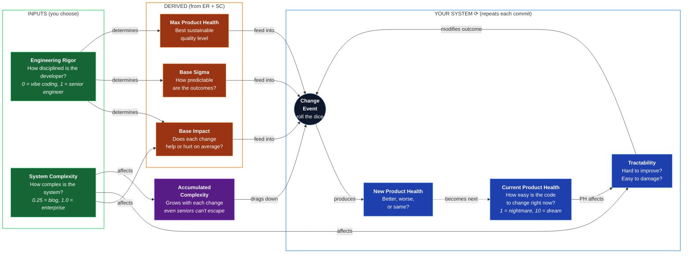

# Product Health Dynamics

A simulation model that predicts how software quality evolves over time based on two inputs: the **engineering rigor** of whoever makes changes, and the **complexity** of the system being built.

The model runs many randomized simulations (a technique called Monte Carlo simulation) to show not just the average outcome, but the range of likely outcomes. This reveals patterns that a single prediction would miss.

## Table of Contents

- [Quick Summary (No Math)](#quick-summary-no-math)
- [Core Concepts](#core-concepts)
- [The Model](#the-model)
  - [How It Works (Visual Overview)](#how-it-works-visual-overview)
  - [The Two Input Parameters](#the-two-input-parameters)
  - [System State Modifies Everything](#system-state-modifies-everything)
  - [The Compounding Effect](#the-compounding-effect-the-entropy-metaphor)
  - [Each Change Event (The Roll of the Dice)](#each-change-event-the-roll-of-the-dice)
- [Agent Profiles](#agent-profiles)
- [Complexity Profiles](#complexity-profiles)
- [What You'll See](#what-youll-see)
- [For Client Conversations](#for-client-conversations)
- [Theoretical Grounding (Research Basis)](./docs/theoretical-grounding.md)
- [Usage](#usage)
- [Repository Structure](#repository-structure)
- [Mathematical Specification](#mathematical-specification)
- [The Complete Equation](#the-complete-equation)

> **Vibe coding:**
>
> _You've built an app. It works. And one day as you are polishing some styling, the AI accidentally deletes 40% of the tests in the backend part of the app. You do not notice, because you are vibe coding, and in the process of making coffee in another room._
>
> _You happily go about your day, blissfully unaware of all what is going on inside the code realms._
>
> _Fast forward two weeks. You now ask the AI to add a new feature. It does. Worked yet again, "vibe coding is great!"_
>
> _Then suddenly, BOOM! 💥_
>
> _Apparently feature x and y broke, now when feature z was added. If we only had tests that would have prevented this…_
>
> _Now we're in a bad situation. Because when I vibe-asked the AI to fix feature x and y while also keeping feature z working, they all started working… but then feature a, b and c suddenly broke, and feature d breaks also, but not always._
>
> _This is the situation I predict every vibe coded project will eventually end up in, if one keeps doing it._

**The question this model answers:** Why does AI-assisted "vibe coding" seem to work at first, then suddenly fall apart? And what does it actually cost to recover?

## Quick Summary (No Math)

- **Product Health** measures how easy code is to change (1 = nightmare, 10 = trivial).
- Every code change can help, hurt, or do nothing. The outcome depends on **Engineering Rigor**: the skill and discipline of whoever makes the change.
- **System Complexity** determines how forgiving the system is. A blog is forgiving; an enterprise platform is not.
- Low-rigor agents (AI vibe coders) have negative expected impact. The codebase decays.
- High-rigor agents (senior engineers) have positive expected impact. The codebase improves.
- **Simple systems are forgiving:** lower-rigor agents can still maintain them; recovery from damage is fast.
- **Complex systems are punishing:** mistakes cascade, recovery is slow, and only high rigor can sustain quality.
- **Decay is slow at first, then accelerates.** A healthy codebase catches mistakes. A coupled codebase lets them cascade.
- **Recovery is slow at first, then accelerates, then plateaus.** Untangling a mess takes time before progress shows.

## Core Concepts

| Term                       | Definition                                                                                                            | Plain Meaning                                                                                                |
| -------------------------- | --------------------------------------------------------------------------------------------------------------------- | ------------------------------------------------------------------------------------------------------------ |
| **Product Health (PH)**    | Software quality at a point in time. Scale: 1-10.                                                                     | How hard or easy changes feel right now.                                                                     |
| **Change Event**           | A modification to the codebase.                                                                                       | The code that actually gets committed.                                                                       |
| **Engineering Rigor (ER)** | Degree to which changes apply: modularity, abstraction, separation of concerns, loose coupling, cohesion. Scale: 0-1. | Skill and discipline of the agent (human or AI). The difference between a calculated move and a gamble.      |
| **System Complexity (SC)** | Inherent architectural complexity of the system. Scale: 0-1. Simple blog = 0.25, enterprise platform = 1.0.           | How many moving parts? How tightly coupled by nature? How much can go wrong?                                 |
| **System Tractability**    | How forgiving or punishing the codebase is right now. Depends on current PH and SC.                                   | Healthy: mistakes are caught or contained. Unhealthy: mistakes cascade. Simpler systems stay more tractable. |
| **Shape Phase**            | Initial development where the AI has full context. Produces impressive results quickly.                               | The honeymoon period. Everything fits in the AI's immediate context window.                                  |
| **Scale Phase**            | Ongoing development where context is lost. The model's dynamics dominate.                                             | Reality sets in. Simulations start here (e.g. PH=8) to show what happens next.                               |
| **Accumulated Complexity** | Inherent disorder that grows with each change. Scales with system complexity.                                         | Technical debt that accrues over time. Simple systems accumulate less; complex systems accumulate more.      |

## The Model

### How It Works (Visual Overview)



### The Two Input Parameters

The model has two inputs. Everything else is derived.

**Engineering Rigor (ER)** — the skill and discipline of the agent (0-1 scale).

**System Complexity (SC)** — the inherent complexity of the system being built (0-1 scale).

| Property        | Formula                            | What It Means                                                           |
| --------------- | ---------------------------------- | ----------------------------------------------------------------------- |
| Base Impact (μ) | `μ = 2.4 × (ER − 0.25 × (1 + SC))` | Expected PH change per commit. Breakeven ER scales with SC (see below). |
| Base Sigma (σ)  | `σ = 0.1 + 0.4 × (1 − ER)`         | Outcome unpredictability. High ER = consistent; low ER = erratic.       |
| Maximum Health  | `maxPH = 5 + 5 × ER`               | Sustainable ceiling. ER=0.8 → maxPH=9. ER=0.1 → maxPH=5.5.              |

**How SC affects breakeven:** The ER required to break even (μ=0) scales with complexity:

```
breakeven_ER = 0.25 × (1 + SC)
```

| System Complexity | SC   | Breakeven ER | Plain Meaning                                      |
| ----------------- | ---- | ------------ | -------------------------------------------------- |
| Simple (blog)     | 0.25 | 0.31         | Even juniors can maintain it without degradation.  |
| Medium (CRUD app) | 0.50 | 0.38         | Some discipline required; vibe coding still risky. |
| Enterprise        | 1.00 | 0.50         | Only skilled engineers maintain positive impact.   |

### System State Modifies Everything

Current Product Health affects how changes land. Healthy codebases catch and contain mistakes; coupled codebases let them cascade.

The model computes **rawSystemState** from Product Health using a sigmoid:

```math
\text{rawSystemState} = \frac{1}{1 + e^{-1.5 \times (PH - 5)}}
```

System Complexity (SC) then provides a **floor** on tractability. Simple systems never become as "frozen" as complex ones—there's less coupling possible:

```math
\text{effectiveSystemState} = (1 - SC) + SC \times \text{rawSystemState}
```

**Plain meaning:** In a simple system (SC=0.25), even at rock-bottom PH, the system stays ~75% tractable. In an enterprise system (SC=1.0), tractability tracks rawSystemState directly.

| PH  | rawSystemState | SC=0.25 (Simple) | SC=1.0 (Enterprise) |
| --- | -------------- | ---------------- | ------------------- |
| 8   | 0.99           | 1.00             | 0.99                |
| 5   | 0.50           | 0.88             | 0.50                |
| 2   | 0.01           | 0.75             | 0.01                |

| What's Modified        | Multiplied By                              | Effect                                                   |
| ---------------------- | ------------------------------------------ | -------------------------------------------------------- |
| Negative base impact   | `(1 − effectiveSystemState)`               | Damage compounds at low PH, caught early at high PH      |
| Positive base impact   | `effectiveSystemState × (1 − (PH/maxPH)²)` | Hard to improve a mess; diminishing returns near ceiling |
| Base sigma             | `(0.6 + 0.4 × bellFactor)`                 | Chaos peaks mid-range; predictable at extremes           |
| Random component       | `(0.15 + 0.85 × effectiveSystemState)`     | Luck cannot save you at low PH; outcomes driven by mean  |
| Accumulated complexity | `× SC`                                     | Simple systems accumulate less inherent complexity       |

Where `bellFactor = 4 × s × (1 − s)` — a parabola peaking at s=0.5, using effectiveSystemState.

### The Compounding Effect (The "Entropy" Metaphor)

> **Note:** This is an analogy, not an application of thermodynamic laws. We use "entropy" as a metaphor because the observable pattern is similar: systems drift toward disorder without sustained effort. The underlying mathematics is different.

In physics, entropy describes how systems tend toward disorder without energy input. Software exhibits a similar pattern: without sustained engineering effort, codebases drift toward chaos.

The driver is **coupling**: how much one part of the code depends on other parts.

- **Loosely coupled:** Changing feature X doesn't break feature Y. Tests catch regressions. Modules have clear boundaries.
- **Tightly coupled:** Everything connects to everything. Fixing X breaks Y. Fixing Y breaks Z. This is the "BOOM" moment in the vibe coding story.

**The math:** When base impact is negative, effective damage = `base × (1 − systemState)`.

- At PH=8: systemState ≈ 0.99, so only ~1% of damage applies. Tests catch regressions, monitoring alerts on failures, modular design contains blast radius.
- At PH=2: systemState ≈ 0.01, so ~99% of damage applies. No safety nets; every mistake cascades through the tightly coupled system.

The same low-ER agent causes roughly **90× more degradation** in a coupled system than in a healthy one.

**Plain meaning:** Low-ER changes (no tests, no modularity) gradually tighten coupling. At first, existing structure catches problems: tests fail, monitoring alerts, modular boundaries contain the blast. But as coupling increases, these safety nets erode. Changes start breaking unrelated features. Eventually, fixing one thing breaks three others. The system accelerates its own decay, just like entropy in physics. The difference: entropy is inevitable; software decay is a choice.

**Accumulated complexity:** Beyond the compounding effect, every change adds inherent complexity. The longer a project runs, the more accumulated complexity it carries.

The math: `complexityDrift = -(base + growth × changeCount) × systemState × SC`

- **Time = changeCount.** Each change is a unit of time.
- **Complexity grows linearly** with each change: `base + growth × changeCount`.
- **Scaled by systemState.** Degraded systems don't pay extra; they're already maximally disordered.
- **Scaled by SC.** Simple systems have fewer moving parts, so less complexity accumulates.

At step 0, accumulated complexity is minimal. By step 1000, it has grown enough to create a visible downward trend even for senior engineers. Simple systems (SC=0.25) feel this pressure at 1/4 the rate of enterprise systems (SC=1.0).

### Each Change Event (The Roll of the Dice)

The previous section explained how system state modifies expected impact (the compounding effect). But software development is also probabilistic: no two code changes are identical, even from the same developer. Each change has an expected outcome (μ) plus randomness (σ). The model combines both using a **Normal (Gaussian) Distribution**.

| Term       | Where It Comes From                                                | Plain Meaning                                             |
| :--------- | :----------------------------------------------------------------- | :-------------------------------------------------------- |
| **μ_eff**  | Base Impact × system state modifiers (see tables above)            | On average, does this change make things better or worse? |
| **σ_eff**  | Base Sigma × bell-curve scaling (see tables above)                 | How predictable is the outcome?                           |
| **N(0,1)** | Random draw from Standard Normal Distribution (mean=0, variance=1) | The dice roll that makes each change unique.              |

For every change event, the new health is calculated as:

```math
\Delta PH = \mu_{eff} + \text{complexityDrift} + \sigma_{eff} \times N(0,1) \times \text{attenuation}
```

(See [Mathematical Specification](#mathematical-specification) for complete formulas including accumulated complexity, soft ceiling, and clamping.)

**What this means in practice:**

- **High Rigor (Senior):** High μ, low σ. They consistently make things better. Their "bad days" are still mostly neutral.
- **Low Rigor (AI Vibe):** Negative μ, high σ. Every change is a gamble. Sometimes it works brilliantly (lucky draw), but on average, the system degrades. At low PH, σ is "frozen" (reduced), meaning outcomes become predictably bad instead of erratic.

Resulting Product Health is always clamped between 1 and 10. A soft ceiling ensures that as health approaches or exceeds an agent's `maxPH`, the positive impact of their changes naturally decays.

## Agent Profiles

An "agent" is anyone (human or AI) making changes to the codebase. Each has a fixed Engineering Rigor (ER). Base Impact depends on both ER and System Complexity (SC).

| Agent              |  ER | Base Impact (SC=1.0) | Base Impact (SC=0.25) | Base Sigma | Max Health |
| ------------------ | --: | :------------------: | :-------------------: | :--------: | :--------: |
| AI Vibe Coder      | 0.3 |        −0.48         |         −0.03         |    0.38    |    6.5     |
| AI with Guardrails | 0.4 |        −0.24         |         +0.21         |    0.34    |    7.0     |
| Junior Engineer    | 0.5 |         0.00         |         +0.45         |    0.30    |    7.5     |
| Senior Engineer    | 0.8 |        +0.72         |         +1.17         |    0.18    |    9.0     |

**Key insight:** In enterprise systems (SC=1.0), juniors break even while vibe coders degrade. In simple systems (SC=0.25), vibe coders are nearly breakeven (−0.03) and juniors have solid positive impact—simple systems are forgiving.

## Complexity Profiles

The UI lets you switch between three system complexity levels:

| Profile    | SC   | Example                                            | Character                                   |
| ---------- | ---- | -------------------------------------------------- | ------------------------------------------- |
| Simple     | 0.25 | Blog, landing page, basic CMS                      | Very forgiving; most agents can maintain    |
| Medium     | 0.50 | CRUD backend with auth, moderate logic             | Some discipline required                    |
| Enterprise | 1.00 | Complex architecture and domain, many integrations | Only high ER (human or AI) sustains quality |

## What You'll See

The visualization has **tabs for each complexity level** (Simple, Medium, Enterprise). All simulations start at PH=8, representing the end of the **Shape Phase**.

**Enterprise (SC=1.0)** — the punishing case:

- **AI Vibe:** Slow decay at first, accelerates around PH ~5, bottoms out at 1.
- **Junior Engineer:** Drifts downward toward 3-4. Breakeven isn't enough to escape the asymmetry.
- **Senior Engineer:** Climbs toward ~9, then slight drift due to accumulated complexity.
- **Handoff (AI → Senior):** Slow S-curve recovery from PH=1 to ~9.

**Simple (SC=0.25)** — the forgiving case:

- **AI Vibe:** Nearly breakeven; drifts slowly, stays much healthier than in enterprise.
- **Junior Engineer:** Positive impact; climbs toward ceiling.
- **Handoff (AI → Senior):** Rapid recovery from any low point.


> Shaded bands are **confidence bands**: 80% of runs land within them. The solid line is the average.

> **Run it yourself:** `npm install && npm run dev` opens an interactive version at `http://localhost:5173`

## For Client Conversations

When a client suggests AI-assisted non-engineers can replace professional engineering:

1. **Present the model.** Engineering Rigor determines all outcomes. Low ER produces negative expected impact per change, regardless of how fast changes ship.

2. **Run the simulation.** The trajectory shows inevitable decline and the true cost of recovery.

3. **Reference established theory.** This model aligns with [Lehman's Laws of Software Evolution](./docs/theoretical-grounding.md):

   - _Increasing Complexity:_ Complexity grows unless work is done to reduce it. ER represents that work.
   - _Declining Quality:_ Quality declines unless rigorously maintained. Low ER makes decline the default.
   - _Feedback System:_ Low PH → damage compounds → lower PH. The system accelerates its own decay.

4. **Quantify the tradeoff.** Fast, cheap delivery with low ER creates a codebase that becomes expensive to change. The cost is deferred, not eliminated. Recovery requires sustained high-ER effort, and the math shows exactly how long.

## Usage

```bash
npm install          # Install dependencies (first time only)
npm run dev          # Start the visualization server
```

This opens a browser at `http://localhost:5173` showing the interactive chart with tabs for each complexity level.

For CLI output:

```bash
npm run simulate:ai                    # Default: enterprise complexity
npm run simulate:ai -- --complexity simple   # Simple system (SC=0.25)
npm run simulate:ai -- --complexity medium   # Medium system (SC=0.5)
npm run simulate:ai -- --complexity enterprise  # Enterprise system (SC=1.0)
```

## Repository Structure

```text
src/
  model/
    Parameters.ts           # All tunable model constants
    ProductHealthModel.ts   # Core simulation model (ER, SC → impact, variance, samples)

  runner/
    Trajectory.ts           # Monte Carlo simulation runner
    Statistics.ts           # Aggregates multiple runs into summary metrics

  scenarios/
    AgentProfiles.ts        # Engineering Rigor values for each agent type
    ComplexityProfiles.ts   # System Complexity values (simple, medium, enterprise)
    ScenarioDefinitions.ts  # Scenario configurations (changes, phases, labels)

  chart/
    colors.ts               # Scenario color palette and theme colors
    config.ts               # Chart.js configuration options
    datasets.ts             # Dataset building and precomputation

  utils/
    Math.ts                 # Pure math helpers (sigmoid, gaussian, percentile, etc.)
    Math.test.ts            # Unit tests for math utilities

  types.ts                  # Shared type definitions
  simulation.ts             # Public API and re-exports
  simulation.test.ts        # Unit tests for model and simulation
  main.ts                   # App entry point (wiring only)
  styles.css                # UI styles
  cli.ts                    # Command-line interface with --complexity flag
```

---

## Mathematical Specification

All parameters below are calibration choices. They can be adjusted based on empirical observation.

### Base Property Parameters

| Parameter        | Value | Rationale                                                                   |
| ---------------- | ----: | --------------------------------------------------------------------------- |
| Impact slope     |   2.4 | Sets sensitivity of impact to rigor. Produces ±1.2 max base impact at SC=1. |
| Min breakeven ER |  0.25 | Minimum discipline required even for simplest systems.                      |
| σ_min            |   0.1 | Minimum variance at ER=1. Even experts have some unpredictability.          |
| σ_max            |   0.5 | Maximum variance at ER=0. How wild swings get with zero discipline.         |
| Ceiling base     |     5 | Minimum achievable ceiling at ER=0.                                         |
| Ceiling slope    |     5 | Makes ceiling range from 5 (ER=0) to 10 (ER=1).                             |

### System State Parameters

| Parameter          |   Value | Rationale                                                                                               |
| ------------------ | ------: | ------------------------------------------------------------------------------------------------------- |
| Threshold          |       5 | Midpoint of PH scale. Below = coupled mess; above = tractable.                                          |
| Steepness (k)      |     1.5 | How sharp the transition around threshold. Moderate value allows recovery while preserving compounding. |
| Ceiling exponent   |       2 | Power in `(PH/maxPH)²`. Higher = sharper diminishing returns near ceiling.                              |
| Bell-curve floor   |     0.6 | Minimum sigma multiplier at extremes. Ensures no one is superhuman.                                     |
| Bell-curve range   |     0.4 | How much chaos increases in the transition zone.                                                        |
| Attenuation floor  |    0.15 | Minimum variance at low PH. Even frozen systems have some noise.                                        |
| Attenuation range  |    0.85 | Portion of variance that scales with system state.                                                      |
| Soft ceiling decay |       5 | Exponent in `e^(-5 × overshoot)`. Controls pull-back when PH exceeds maxPH.                             |
| Complexity base    |   0.005 | Initial complexity cost per change. Small but present from the start.                                   |
| Complexity growth  | 0.00005 | How much complexity increases per change. Accumulates over time.                                        |

### Complete Formulas

> **Notation:** `e` is Euler's number (~2.718). `s` = effectiveSystemState. `SC` = System Complexity.

**System state (with complexity floor):**

```math
\text{rawSystemState} = \frac{1}{1 + e^{-1.5 \times (PH - 5)}}
```

```math
s = (1 - SC) + SC \times \text{rawSystemState}
```

Simple systems (low SC) have a floor on tractability; they never become as "frozen" as complex systems.

**Expected impact (breakeven scales with SC):**

```math
\mu_{base} = 2.4 \times (ER - 0.25 \times (1 + SC))
```

```math
\mu_{eff} = \begin{cases}
\mu_{base} \times (1 - s) & \text{if } \mu_{base} \leq 0 \\
\mu_{base} \times s \times \left(1 - \left(\frac{PH}{maxPH}\right)^2\right) & \text{if } \mu_{base} > 0
\end{cases}
```

**Sigma (standard deviation):**

```math
\sigma_{base} = 0.1 + 0.4 \times (1 - ER)
```

```math
\text{bellFactor} = 4 \times s \times (1 - s)
```

```math
\sigma_{eff} = \sigma_{base} \times (0.6 + 0.4 \times \text{bellFactor})
```

**Accumulated complexity (scaled by SC):**

```math
\text{complexityRate} = 0.005 + 0.00005 \times \text{changeCount}
```

```math
\text{complexityDrift} = -\text{complexityRate} \times s \times SC
```

Simple systems accumulate less inherent complexity (fewer moving parts to entangle).

**Change event (the random draw):**

```math
\text{attenuation} = 0.15 + 0.85 \times s
```

```math
\Delta PH = \mu_{eff} + \text{complexityDrift} + \sigma_{eff} \times N(0,1) \times \text{attenuation}
```

**Soft ceiling** (when exceeding maxPH):

```math
\text{if } \Delta > 0 \text{ and } PH > maxPH: \quad \Delta = \Delta \times e^{-5 \times \frac{PH - maxPH}{maxPH}}
```

**Final result** (clamped to valid range):

```math
PH_{new} = \text{clamp}(PH + \Delta, 1, 10)
```

---

## The Complete Equation

For those who want the entire model in one formula:

```math
PH_{n+1} = \text{clamp}\Big(PH_n + \mu_{eff} - c(n) \cdot s \cdot SC + \sigma_{eff} \cdot \varepsilon \cdot a, \; 1, \; 10\Big)
```

### Every Term Explained

> **Shorthand:** `s` = effectiveSystemState, `a` = attenuation, `c(n)` = complexityRate, `SC` = System Complexity.

| Symbol        | Name                   | What It Means                                                                                             |
| ------------- | ---------------------- | --------------------------------------------------------------------------------------------------------- |
| **PH_n**      | Current Product Health | How easy the code is to change right now (1-10 scale).                                                    |
| **PH\_{n+1}** | Next Product Health    | What the Product Health becomes after one code change.                                                    |
| **μ_eff**     | Effective Impact       | Help or hurt? Depends on ER, SC, and current system state.                                                |
| **c(n)**      | Complexity Rate        | Inherent complexity that grows with each change: `0.005 + 0.00005 × n`.                                   |
| **s**         | Effective System State | How tractable the codebase is. Simple systems stay tractable; complex systems can become "frozen."        |
| **SC**        | System Complexity      | Inherent complexity of the system (0.25 = blog, 1.0 = enterprise). Scales complexity drift and breakeven. |
| **σ_eff**     | Effective Sigma        | How unpredictable the outcome is. Low ER = wild swings; high ER = consistent.                             |
| **ε**         | Random Draw            | A dice roll from a Normal distribution. Some changes go better or worse than expected.                    |
| **a**         | Attenuation            | How much randomness matters. In a frozen codebase, luck cannot save you.                                  |
| **clamp**     | Bounds                 | Keeps the result between 1 and 10.                                                                        |

### The Story It Tells

1. **Your skill (μ_eff)** determines whether changes help or hurt on average.
2. **System complexity (SC)** sets the difficulty level. Simple systems forgive low rigor; complex systems punish it.
3. **Time (c(n))** works against everyone—but slower for simple systems.
4. **Tractability (s)** amplifies everything. Good code catches mistakes; bad code lets them cascade.
5. **Randomness (ε)** means any single change could go either way, but averages reveal the trend.
6. **In the long run**, only sustained high-skill effort can outpace complexity—and the bar is higher for complex systems.
