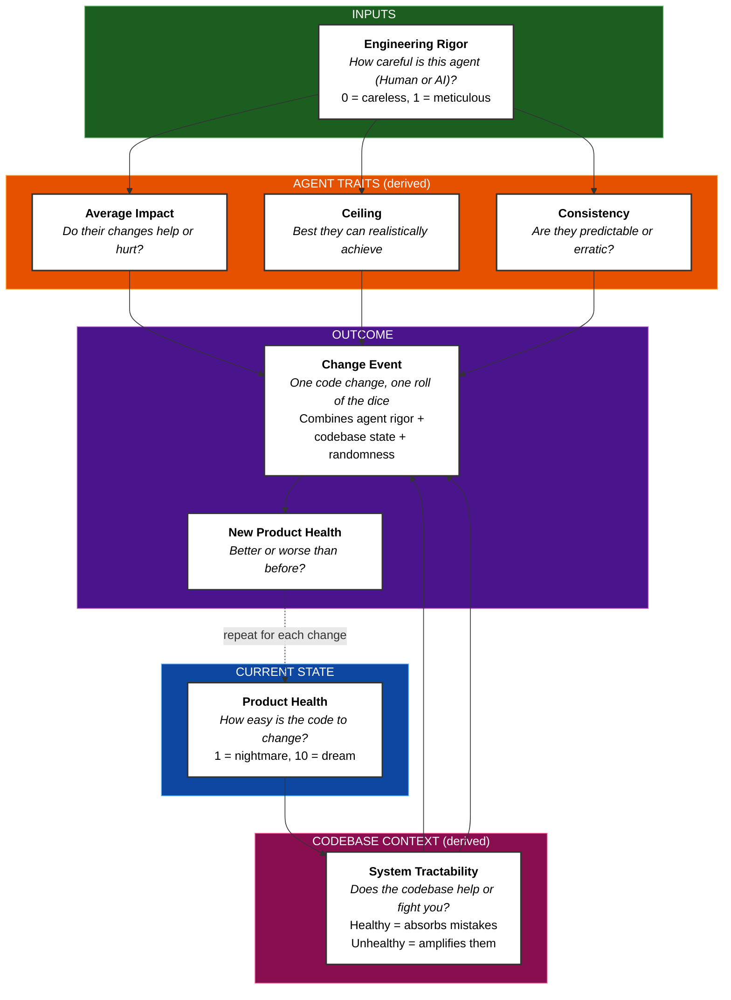

# Product Health Dynamics

A simulation model that predicts how software quality evolves over time based on the engineering rigor of whoever is making changes.

The model runs many randomized simulations (a technique called Monte Carlo simulation) to show not just the average outcome, but the range of likely outcomes. This reveals patterns that a single prediction would miss.

## Table of Contents

- [Quick Summary (No Math)](#quick-summary-no-math)
- [Core Concepts](#core-concepts)
- [The Model](#the-model)
  - [How It Works (Visual Overview)](#how-it-works-visual-overview)
  - [Engineering Rigor as the Master Dial](#engineering-rigor-as-the-master-dial)
  - [System State Modifies Everything](#system-state-modifies-everything)
  - [The Compounding Effect](#the-compounding-effect-the-entropy-metaphor)
  - [Each Change Event](#each-change-event)
- [Agent Profiles](#agent-profiles)
- [What You'll See](#what-youll-see)
- [For Client Conversations](#for-client-conversations)
- [Usage](#usage)
- [Repository Structure](#repository-structure)
- [Mathematical Specification](#mathematical-specification)

> **Vibe coding:**
>
> _You've built an app. It works. And one day as you are polishing some styling, the AI accidentally deletes 40% of the tests in the backend part of the app. You do not notice, because you are vibe coding, and in the process of making coffee in another room._
>
> _You happily go about your day, blissfully unaware of all what is going on inside the code realms._
>
> _Fast forward two weeks. You now ask the AI to add a new feature. It does. Worked yet again, "vibe coding is great!"_
>
> _Then suddenly, BOOM! 💥_
>
> _Apparently feature x and y broke, now when feature z was added. If we only had tests that would have prevented this…_
>
> _Now we're in a bad situation. Because when I vibe-asked the AI to fix feature x and y while also keeping feature z working, they all started working… but then feature a, b and c suddenly broke, and feature d breaks also, but not always._
>
> _This is the situation I predict every vibe coded project will eventually end up in, if one keeps doing it._

**The question this model answers:** Why does AI-assisted "vibe coding" seem to work at first, then suddenly fall apart? And what does it actually cost to recover?

## Quick Summary (No Math)

- **Product Health** measures how easy code is to change (1 = nightmare, 10 = trivial).
- Every code change can help, hurt, or do nothing. The outcome depends on **Engineering Rigor**: the skill and discipline of whoever makes the change.
- Low-rigor agents (AI vibe coders) have negative expected impact. The codebase decays.
- High-rigor agents (senior engineers) have positive expected impact. The codebase improves.
- **Decay is slow at first, then accelerates.** A healthy codebase absorbs mistakes. A coupled codebase amplifies them.
- **Recovery is slow at first, then accelerates, then plateaus.** Untangling a mess takes time before progress shows.

## Core Concepts

| Term                       | Definition                                                                                                            | Plain Meaning                                                                |
| -------------------------- | --------------------------------------------------------------------------------------------------------------------- | ---------------------------------------------------------------------------- |
| **Product Health (PH)**    | Software quality at a point in time. Scale: 1-10.                                                                     | How hard or easy changes feel right now.                                     |
| **Change Event**           | A modification to the codebase.                                                                                       | The code that actually gets committed.                                       |
| **Engineering Rigor (ER)** | Degree to which changes apply: modularity, abstraction, separation of concerns, loose coupling, cohesion. Scale: 0-1. | Skill and discipline. The difference between a calculated move and a gamble. |
| **Maximum Health**         | Highest PH an agent can sustainably achieve. Derived from ER.                                                         | Your ceiling. Even seniors can't reach perfection.                           |

## The Model

### How It Works (Visual Overview)



### Engineering Rigor as the Master Dial

**Engineering Rigor (ER)** is the only input variable. Everything else is derived from it.

| Property        | Formula                    | What It Means                                                         |
| --------------- | -------------------------- | --------------------------------------------------------------------- |
| Base Impact (μ) | `μ = ER × 2.4 − 1.2`       | Expected PH change per commit. Positive above ER=0.5, negative below. |
| Base Sigma (σ)  | `σ = 0.1 + 0.4 × (1 − ER)` | Outcome unpredictability. High ER = consistent; low ER = erratic.     |
| Maximum Health  | `maxPH = 5 + 5 × ER`       | Sustainable ceiling. ER=0.8 → maxPH=9. ER=0.1 → maxPH=5.5.            |

### System State Modifies Everything

Current Product Health affects how changes land. This captures the reality that healthy codebases absorb mistakes while coupled codebases amplify them.

The model computes an intermediate variable called **systemState**, which transforms Product Health into a 0-1 scale:

```
systemState = 1 / (1 + e^(-1.5 × (PH − 5)))
```

**Plain meaning:** systemState answers "how tractable is this codebase right now?"

- At PH=8 (healthy): systemState ≈ 0.99. The system is tractable; it has tests, modularity, and clear boundaries.
- At PH=5 (threshold): systemState = 0.5. The tipping point between order and chaos.
- At PH=2 (degraded): systemState ≈ 0.01. The system is a tightly coupled mess; everything depends on everything.

| Situation            | Modifier                            | Effect                                                   |
| -------------------- | ----------------------------------- | -------------------------------------------------------- |
| Negative base impact | `× (1 − systemState)`               | Damage compounds at low PH, absorbed at high PH          |
| Positive base impact | `× systemState × (1 − (PH/maxPH)²)` | Hard to improve a mess; diminishing returns near ceiling |
| Variance             | `× (0.15 + 0.85 × systemState)`     | Outcomes "freeze" at low PH; normal variance at high PH  |

### The Compounding Effect (The "Entropy" Metaphor)

> **Note:** This is an analogy, not an application of thermodynamic laws. We use "entropy" as a metaphor because the observable pattern is similar: systems drift toward disorder without sustained effort. The underlying mathematics is different.

In physics, entropy describes how systems tend toward disorder without energy input. Software exhibits a similar pattern: without sustained engineering effort, codebases drift toward chaos.

The driver is **coupling**: how much one part of the code depends on other parts.

- **Loosely coupled:** Changing feature X doesn't break feature Y. Tests catch regressions. Modules have clear boundaries.
- **Tightly coupled:** Everything connects to everything. Fixing X breaks Y. Fixing Y breaks Z. This is the "BOOM" moment in the vibe coding story.

**The math:** When base impact is negative, effective damage = `base × (1 − systemState)`.

- At PH=8: systemState ≈ 0.99, so only ~1% of damage applies. The healthy system absorbs mistakes.
- At PH=2: systemState ≈ 0.01, so ~99% of damage applies. Every mistake lands with full force.

The same low-ER agent causes roughly **90× more degradation** in a coupled system than in a healthy one.

**Plain meaning:** Low-ER changes (no tests, no modularity) gradually tighten coupling. At first, existing structure absorbs the damage. But as coupling increases, changes start breaking unrelated features. Eventually, fixing one thing breaks three others. The system accelerates its own decay, just like entropy in physics. The difference: entropy is inevitable; software decay is a choice.

### Each Change Event

Every commit draws from a normal distribution:

```
ΔPH = μ_effective + σ_effective × N(0,1)
```

Result is clamped to [1, 10]. A soft ceiling pulls PH back toward maxPH when exceeded.

## Agent Profiles

Only ER is configured. All other values are derived.

| Agent              |  ER | → Base Impact | → Base Sigma | → Max Health |
| ------------------ | --: | :-----------: | :----------: | :----------: |
| AI Vibe Coder      | 0.1 |     −0.96     |     0.46     |     5.5      |
| AI with Guardrails | 0.3 |     −0.48     |     0.38     |     6.5      |
| Junior Engineer    | 0.5 |     0.00      |     0.30     |     7.5      |
| Senior Engineer    | 0.8 |     +0.72     |     0.18     |     9.0      |

**Key insight:** Junior engineers break even (μ=0). They don't improve the system, but they don't systematically degrade it either. AI vibe coders have strongly negative expected impact; every change makes things slightly worse on average.

## What You'll See

- **AI Vibe:** Slow decay at first, accelerates around PH ~5, bottoms out at 1.
- **AI with Guardrails:** Slower decay, but still negative trajectory. Buys time, not salvation.
- **Junior Engineer:** Hovers around 7-8. High variance, but no systematic drift.
- **Senior Engineer:** Steady climb from 8 toward ~9, then stabilizes.
- **Handoff (AI → Senior):** AI decays to 1. Seniors struggle initially (the mess resists improvement), then recover in an S-curve toward their ceiling.
- **Handoff (AI → Junior):** AI decays to 1. Juniors recover more slowly and plateau lower than seniors.

Shaded bands are **confidence bands**: they show the range where 80% of simulation runs land. The solid line is the average. Roughly: "best realistic case" at the top, "worst realistic case" at the bottom, with extremes (top/bottom 10%) excluded.


> **Run it yourself:** `npm install && npm run dev` opens an interactive version at `http://localhost:5173`

## For Client Conversations

When a client suggests AI-assisted non-engineers can replace professional engineering:

1. **Present the model.** Engineering Rigor determines all outcomes. Low ER produces negative expected impact per change, regardless of how fast changes ship.

2. **Run the simulation.** The trajectory shows inevitable decline and the true cost of recovery.

3. **Reference established theory.** This model aligns with Lehman's Laws of Software Evolution:

   - _Increasing Complexity:_ Complexity grows unless work is done to reduce it. ER represents that work.
   - _Declining Quality:_ Quality declines unless rigorously maintained. Low ER makes decline the default.
   - _Feedback System:_ Low PH → damage compounds → lower PH. The system accelerates its own decay.

4. **Quantify the tradeoff.** Fast, cheap delivery with low ER creates a codebase that becomes expensive to change. The cost is deferred, not eliminated. Recovery requires sustained high-ER effort, and the math shows exactly how long.

## Usage

```bash
npm install          # Install dependencies (first time only)
npm run dev          # Start the visualization server
```

This opens a browser at `http://localhost:5173` showing the interactive chart with all scenarios.

For CLI output instead:

```bash
npm run simulate:ai  # Print trajectory statistics to console
```

## Repository Structure

```
src/
  model/
    Parameters.ts           # All tunable model constants
    ProductHealthModel.ts   # Core simulation model (derives impact, variance, samples changes)

  runner/
    Trajectory.ts           # Monte Carlo simulation runner
    Statistics.ts           # Aggregates multiple runs into summary metrics

  scenarios/
    AgentProfiles.ts        # Engineering Rigor values for each agent type
    ScenarioDefinitions.ts  # Scenario configurations (changes, phases, labels)

  utils/
    Math.ts                 # Pure math helpers (sigmoid, gaussian, percentile, etc.)
    Math.test.ts            # Unit tests for math utilities

  types.ts                  # Shared type definitions
  simulation.ts             # Public API and re-exports
  simulation.test.ts        # Unit tests for model and simulation
  main.ts                   # Chart.js visualization
  cli.ts                    # Command-line interface
```

**Design principles:**

- **Single Responsibility:** Each file does one thing.
- **Self-documenting:** File and class names describe their purpose; minimal comments.
- **Testable:** `ProductHealthModel` encapsulates all model logic; pure functions in `utils/`.
- **Configurable:** All magic numbers live in `Parameters.ts`.

---

## Mathematical Specification

All parameters below are calibration choices. They can be adjusted based on empirical observation.

### Base Property Parameters

| Parameter        | Value | Rationale                                                                      |
| ---------------- | ----: | ------------------------------------------------------------------------------ |
| Impact slope     |   2.4 | Sets sensitivity of impact to rigor. Produces ±1.2 max base impact per change. |
| Impact intercept |   1.2 | Places breakeven at ER=0.5. Above improves; below degrades.                    |
| σ_min            |   0.1 | Minimum variance at ER=1. Even experts have some unpredictability.             |
| σ_max            |   0.5 | Maximum variance at ER=0. How wild swings get with zero discipline.            |
| Ceiling base     |     5 | Minimum achievable ceiling at ER=0.                                            |
| Ceiling slope    |     5 | Makes ceiling range from 5 (ER=0) to 10 (ER=1).                                |

### System State Parameters

| Parameter          | Value | Rationale                                                                                               |
| ------------------ | ----: | ------------------------------------------------------------------------------------------------------- |
| Threshold          |     5 | Midpoint of PH scale. Below = coupled mess; above = tractable.                                          |
| Steepness (k)      |   1.5 | How sharp the transition around threshold. Moderate value allows recovery while preserving compounding. |
| Ceiling exponent   |     2 | Power in `(PH/maxPH)²`. Higher = sharper diminishing returns near ceiling.                              |
| Sigma scale floor  |  0.15 | Minimum sigma multiplier. Even frozen systems retain 15% unpredictability.                              |
| Sigma scale range  |  0.85 | Portion of sigma affected by system state.                                                              |
| Soft ceiling decay |     5 | Exponent in `e^(-5 × overshoot)`. Controls pull-back when PH exceeds maxPH.                             |

### Complete Formulas

**System state:**

```
systemState(PH) = 1 / (1 + e^(-1.5 × (PH − 5)))
```

**Expected impact:**

```
baseImpact = ER × 2.4 − 1.2

if baseImpact ≤ 0:
    μ_eff = baseImpact × (1 − systemState)
else:
    μ_eff = baseImpact × systemState × (1 − (PH / maxPH)²)
```

**Variance:**

```
σ_base = 0.1 + 0.4 × (1 − ER)
σ_eff = σ_base × (0.15 + 0.85 × systemState)
```

**Change event:**

```
Δ = μ_eff + σ_eff × N(0,1)

if Δ > 0 and PH > maxPH:
    overshoot = (PH − maxPH) / maxPH
    Δ = Δ × e^(-5 × overshoot)

PH_new = clamp(PH + Δ, 1, 10)
```
